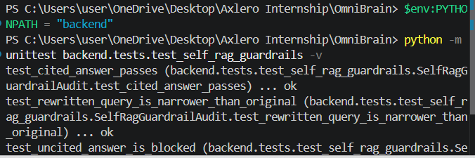

# Mid-Project Reasoning Audit

## Goal

Demonstrate that the LangGraph supervisor selects vector retrieval for uploaded-document questions and SQLite for structured historical market-data questions.

## Routing contract

| Prompt type | Expected route | Evidence source |
| --- | --- | --- |
| Uploaded report, PDF, table, summary, or document fact | `document_agent` | Qdrant vector search |
| Historical stock price, OHLC value, or trading volume | `sql_agent` | SQLite `market_prices` table |

The deterministic pre-router handles unambiguous market-data requests before the LLM supervisor. This makes the routing decision repeatable and prevents a selected PDF from overriding a request for structured time-series data.

## Run the audit

From the project root on PowerShell:

```powershell
$env:PYTHONPATH = "backend"
python -m unittest discover -s backend/tests -v
```

Expected result: four passing tests, covering two vector-document prompts and two SQL-market-data prompts.

## Self-RAG and guardrail audit

The document route now retries once when retrieved chunks are empty or score below `0.45`. The retry narrows the query to direct facts, named entities, and numerical evidence. If that retry is still weak, OmniBrain refuses to answer rather than generating an ungrounded response. A final citation check also blocks responses that omit `[Source n]` citations.

Run all audits with:

```powershell
$env:PYTHONPATH = "backend"
python -m unittest discover -s backend/tests -v
```

To run only the self-correction proof:

```powershell
$env:PYTHONPATH = "backend"
python -m unittest backend.tests.test_self_rag_guardrails -v
```

This check proves that low-scoring retrieval triggers a retry, the retry query is narrowed, uncited answers are blocked, and cited answers are accepted.



## Presentation

Download the project-review deck: [OmniBrain Agentic RAG Project Presentation](presentations/OmniBrain_Agentic_RAG_Project_Presentation.pptx).

Download the written project report: [Axlero OmniBrain Project Report](reports/Axlero_OmniBrain_Project_Report.pdf).

## Demo queries

```text
Summarize the uploaded annual report.
What does the revenue table in this PDF show?
What was AAPL's closing price on 2025-01-10?
Show MSFT trading volume on 2025-01-10.
```

The local SQLite database is created automatically at `data/market_data.db` on first use. It contains seed data for AAPL and MSFT and accepts only parameterized, application-defined queries.
